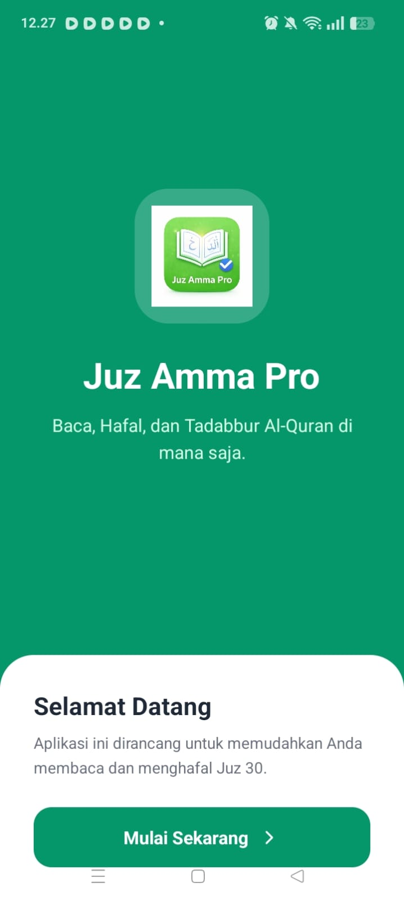
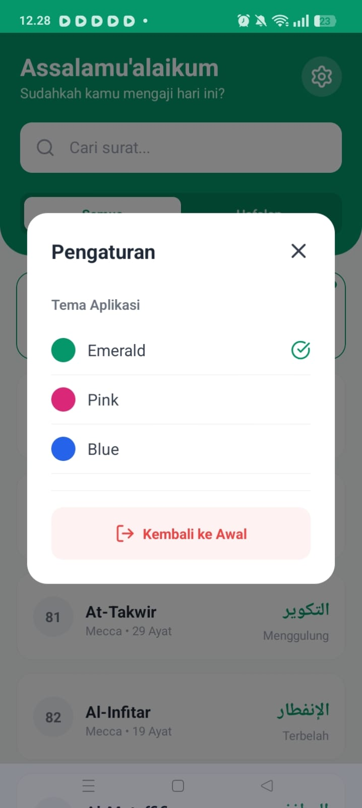
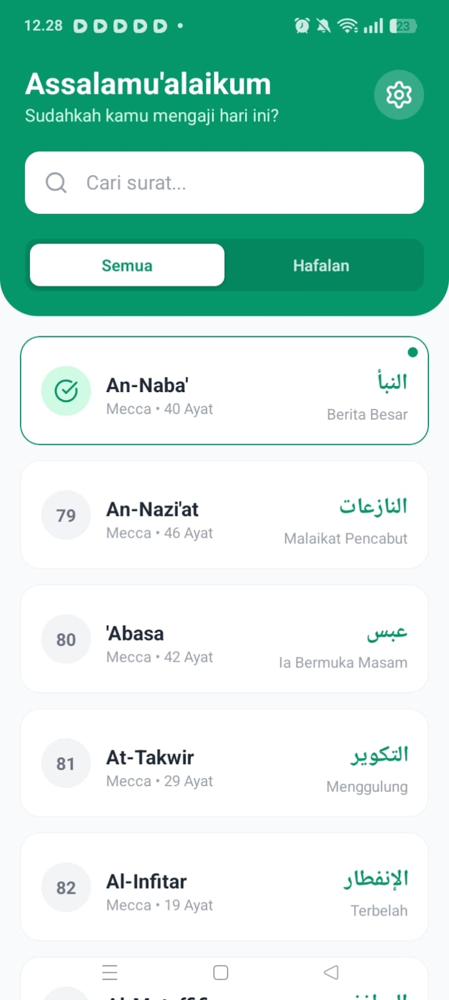
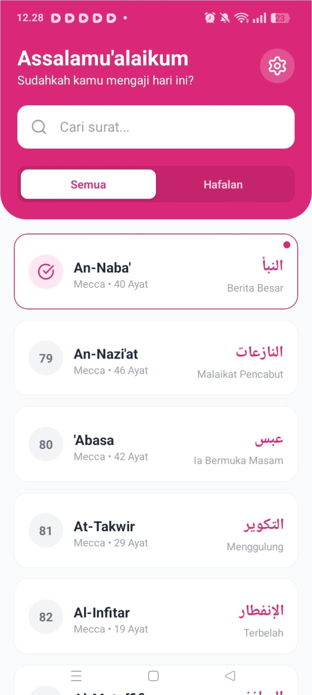
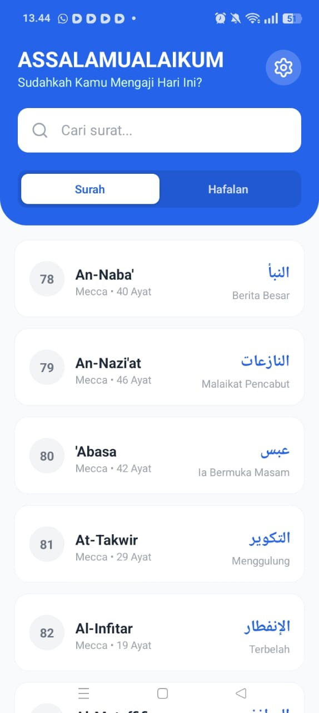
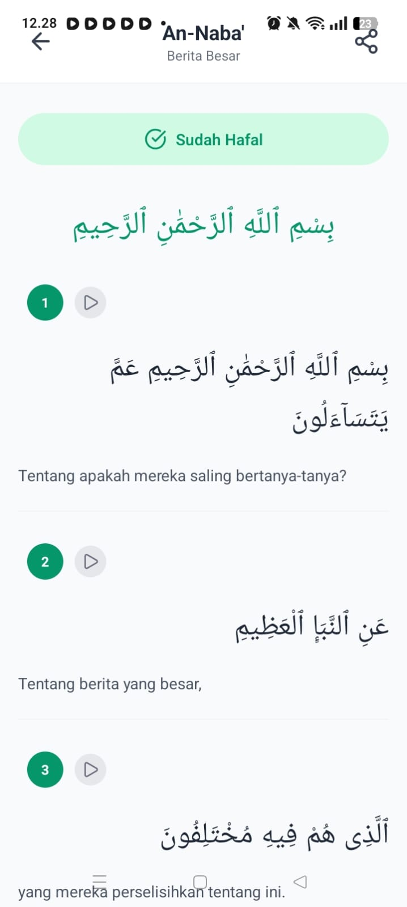
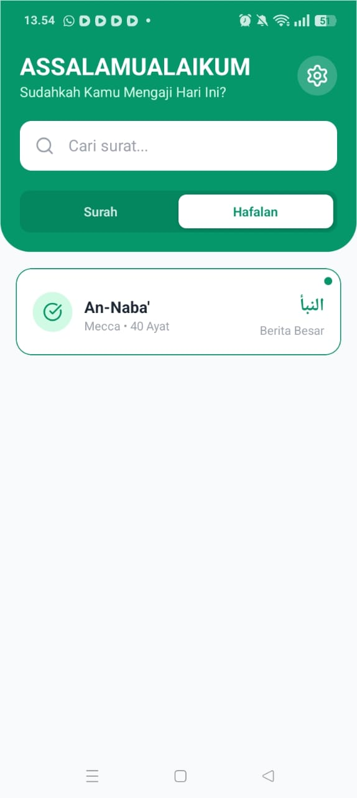

# 📖 JuzAmmaPro

JuzAmmaPro adalah aplikasi mobile berbasis **React Native & Expo** yang dirancang untuk membantu pengguna membaca, mendengarkan, dan menghafal **Juz Amma** secara digital dengan pengalaman yang sederhana, modern, dan nyaman digunakan.

Aplikasi ini mendukung pemutaran audio murottal, bookmark ayat terakhir, catatan tadabbur, serta penyimpanan data secara lokal agar tetap tersimpan meskipun aplikasi ditutup.

---

## 📱 Preview Aplikasi

**1. WELCOME PAGE**

**2. SETTING**

**3. HIJAU**

**4. MERAH MUDA**

**5. BIRU**

**7. DIHAFAL**

**7. DIHAFAL**

---

## ✨ Fitur Utama

- 📖 **Daftar Surah Juz Amma**
- 🔊 **Audio Murottal per Ayat**
- ▶️ **Play / Pause & Auto Next Ayat**
- 🔖 **Bookmark (Terakhir Dibaca)**
- ✅ **Checklist Hafalan**
- 📝 **Catatan Tadabbur**
- 🎨 **Pengaturan Tema Warna**
- 💾 **Penyimpanan Data Lokal (Offline Friendly)**

---

## 🧱 Tech Stack

### 1️⃣ Framework & Core

- **React Native**  
  Framework utama untuk membangun aplikasi mobile Android & iOS menggunakan JavaScript/TypeScript.

- **Expo**  
  Digunakan untuk mempermudah proses pengembangan, testing, dan build aplikasi React Native.

- **React**  
  Library untuk membangun antarmuka pengguna (UI) berbasis komponen.

---

### 2️⃣ Bahasa Pemrograman

- **TypeScript (.tsx)**  
  Seluruh aplikasi ditulis menggunakan TypeScript untuk meningkatkan keamanan tipe data dan mengurangi potensi bug.  
  Contohnya terlihat dari penggunaan:
  - `interface SurahData`
  - `interface VerseData`
  - Konfigurasi `tsconfig.json`

---

### 3️⃣ Library & Fitur Khusus

- **expo-av**  
  Digunakan untuk memutar audio murottal Al-Qur’an, termasuk fitur play, pause, dan auto-next ayat.

- **@react-native-async-storage/async-storage**  
  Digunakan untuk menyimpan data secara lokal di perangkat pengguna, seperti:

  - Bookmark (ayat terakhir dibaca)
  - Status hafalan
  - Catatan tadabbur
  - Preferensi tema warna

- **lucide-react-native**  
  Library ikon vektor yang modern dan ringan (Play, Pause, Settings, Share, dll).

- **react-native-svg**  
  Dependency pendukung agar ikon vektor dari Lucide dapat dirender dengan baik.

---

### 4️⃣ Sumber Data (API)

- **Al Quran Cloud API**  
  (`https://api.alquran.cloud`)

  Aplikasi ini mengambil data secara real-time menggunakan `fetch`, meliputi:

  - Teks Arab Al-Qur’an
  - Terjemahan
  - Audio murottal

  Dengan pendekatan ini, aplikasi tidak menyimpan seluruh teks Al-Qur’an di dalam source code.

---

### 5️⃣ Styling

- **React Native StyleSheet**  
  Styling dilakukan menggunakan `StyleSheet.create({...})` untuk performa yang optimal dan konsisten di berbagai perangkat.

---
